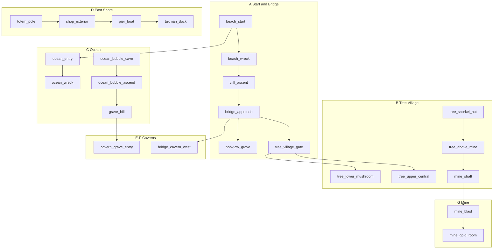

# Treasure Island Dizzy — полная карта экранов (Phase 3)

> Справочник для ремейка. Оригинал: **~46 flick-screens** (Oliver Twins design notes).  
> Источники: [Lanzz walkthrough](https://gamefaqs.gamespot.com/sinclair/947056-treasure-island-dizzy/faqs/65007), [Crazyreyn C64 FAQ](https://gamefaqs.gamespot.com/c64/568693-treasure-island-dizzy/faqs/45673).

## Регионы

| Регион | id prefix | Экранов | Описание |
|--------|-----------|---------|----------|
| A — Стартовый пляж | `beach_*`, `cliff_*` | 5 | Кораблекрушение, скала, мост |
| B — Деревня на деревьях | `tree_*` | 16 | Верхние/нижние тропы, ловушки, snorkel |
| C — Океан | `ocean_*`, `underwater_*` | 6 | Корабль, пузырь, рыбы |
| D — Восточный берег | `grave_*`, `totem_*`, `shop_*`, `pier_*` | 9 | Лавочник, лодка, taxman |
| E — Пещера под могилой | `cavern_*`, `blackbeard_*` | 6 | Smuggler's cave, кухня |
| F — Пещера под мостом | `bridge_cavern_*` | 3 | Проклятое сокровище |
| G — Шахта | `mine_*` | 3 | Динамит, мешок монет |
| **Slice (Phase 2)** | см. ниже | 8 | Упрощённый маршрут к лавочнику |

**Итого целевых экранов:** 48 (+ 8 slice переиспользуются / постепенно выравниваются под канон).

---

## Slice → полная карта (миграция)

Phase 2 slice — сжатый восточный маршрут. При расширении:

| Slice id | Роль в полной игре | Заметки |
|----------|-------------------|---------|
| `beach_start` | Старт (регион A) | coin 1; snorkel **перенести** в `tree_snorkel_hut` |
| `beach_right` | Восточный берег | Промежуточный пляж → `pier_*` |
| `beach_jetty` | `pier_key` / причал | Вода, coin, спуск в океан |
| `village_path` | Тропа к лавочнику | ↑ → `cave_entrance` (заглушка → `mine_shaft`) |
| `shop_exterior` | `shop_exterior` | Без изменений |
| `shop_interior` | `shop_interior` | NPC + trade chain |
| `underwater_shallow` | `ocean_entry` | coin 16–17 |
| `cave_entrance` | `mine_shaft` / `cavern_*` | Заменить заглушку |

---

## A — Стартовый пляж и мост (5)

| id | Описание | Предметы / hazards | Exits | Coins |
|----|----------|-------------------|-------|-------|
| `beach_start` | Стартовый пляж | plant #1 → coin | **L** `beach_wreck`, **R** `beach_right` | 1 |
| `beach_wreck` | Обломки, скала | empty solid chest | **L** `cliff_ascent`, **R** `beach_start` | — |
| `cliff_ascent` | Скала над пляжем | chest as step (puzzle) | **D** `beach_wreck`, **L** `bridge_approach` | 2 |
| `bridge_approach` | Мост Hookjaw | plant #2, **Trap** (lower path) | **L** `hookjaw_grave`, **R** `cliff_ascent`, **U** `tree_village_gate` (upper) | 3, 4 |
| `hookjaw_grave` | Могила Hookjaw | toothpaste (useless) | **L** `tree_village_gate`, **R** `bridge_approach` | — |

---

## B — Деревня на деревьях (16)

| id | Описание | Предметы / hazards | Exits | Coins |
|----|----------|-------------------|-------|-------|
| `tree_village_gate` | Вход в деревню, хижина | misty window #5 | **L** `tree_lower_mushroom`, **R** `hookjaw_grave`, **D** `bridge_approach`, **U** `tree_upper_central` | 5 |
| `tree_lower_mushroom` | Под хижиной | mushrooms #6 | **L** `tree_lower_west`, **R** `tree_village_gate` | 6 |
| `tree_lower_west` | Нижняя тропа | — | **L** `tree_balcony_east`, **R** `tree_lower_mushroom` | 7 |
| `tree_balcony_east` | Балкон, лестница | wooden rail #1 | **L** `tree_upper_east`, **R** `tree_lower_west`, **U** jump → `tree_upper_east` | 8 |
| `tree_upper_east` | Верхняя платформа | — | **L** `tree_upper_central`, **R** `tree_balcony_east` | 9 |
| `tree_upper_central` | Центральная хижина | — | **L** `tree_upper_west_trunk`, **R** `tree_upper_east`, **D** `tree_village_gate` | 10 |
| `tree_upper_west_trunk` | Тропа вверх-влево | bit of trunk #1 | **L** `tree_upper_far_west`, **R** `tree_upper_central` | 11 |
| `tree_upper_far_west` | Высокая платформа | **Trap** (ledge) | **L** `tree_lower_dip`, **R** `tree_upper_west_trunk` | 12 |
| `tree_lower_dip` | Спуск/подъём | bit of trunk #2 | **L** `tree_trap_ledge`, **R** `tree_upper_far_west` | 13 |
| `tree_trap_ledge` | Ловушка на уступе | **Trap** (floor) | **L** `tree_snorkel_hut`, **R** `tree_lower_dip` | 14 |
| `tree_snorkel_hut` | Верхний hut | **rubber snorkel** | **L** `tree_above_mine`, **R** `tree_trap_ledge`, jump L → `tree_above_mine` | 15 |
| `tree_above_mine` | Над шахтой | plant #3 | **D** `mine_shaft`, **R** `tree_snorkel_hut` | — |
| `tree_detonator` | Верхний уровень | infra red detonator | **L** `tree_rail_coin`, **R** `tree_sword_hut` | — |
| `tree_rail_coin` | Нижний балкон | wooden rail #2 | **R** `tree_detonator` | 29 |
| `tree_sword_hut` | Правый верх | sharp glass sword | **L** `tree_detonator`, **D** `tree_camera_ledge` | — |
| `tree_camera_ledge` | Под мечом | small video camera, **Trap** (trees) | **U** `tree_sword_hut` | — |

---

## C — Океан (6)

| id | Описание | Предметы / hazards | Exits | Coins |
|----|----------|-------------------|-------|-------|
| `ocean_entry` | Вода у старта | **WaterZone**, fish | **L** `beach_start`, **R** `ocean_fish_run` | 16 |
| `ocean_fish_run` | Рыба-school | **Large Fish** hazard | **L** `ocean_entry`, **R** `ocean_wreck` | — |
| `ocean_wreck` | Затонувший корабль | skull #1, **Crab** | **L** `ocean_fish_run`, **R** `ocean_spade_bay` | 17, 18 |
| `ocean_spade_bay` | За кораблём | salt water spade | **L** `ocean_wreck`, **R** `ocean_bubble_cave` | 19 |
| `ocean_bubble_cave` | Пузырь + пещера | spade use → bubbles, **Cuttlefish** | **L** `ocean_spade_bay`, **U** `ocean_bubble_ascend` | — |
| `ocean_bubble_ascend` | Верх на пузыре | — | **L** `grave_hill`, **D** `ocean_bubble_cave` | 20 |

---

## D — Восточный берег и лавочник (9)

| id | Описание | Предметы / hazards | Exits | Coins |
|----|----------|-------------------|-------|-------|
| `grave_hill` | Могила (второй) | sword use → hole, woodcutters axe | **L** `totem_pole`, **R** `ocean_bubble_ascend`, **D** `cavern_grave_entry` | 21 |
| `totem_pole` | Тотем, хижина | big red rock, holy bible | **L** `village_path`, **R** `grave_hill`, **E** door → `shop_exterior` | 22 |
| `shop_exterior` | Лавочник снаружи | — | **L** `totem_pole`, **R** `shop_interior`, **U** `shop_roof` | — |
| `shop_interior` | Лавочник (NPC) | **Shopkeeper** — trade chain | **L** `shop_exterior` | 22 (crate) |
| `shop_roof` | Крыша | empty bucket | **D** `shop_exterior` | 23 |
| `shop_east` | Две хижины | plant #4 | **L** `shop_exterior`, **R** `pier_key` | 24 |
| `pier_key` | Причал | large golden key | **L** `shop_east`, **R** `pier_boat` | — |
| `pier_boat` | Сборка лодки | boat parts use | **L** `pier_key`, **R** `taxman_dock` | — |
| `taxman_dock` | Taxman, финал | **Win** — 30 coins | **L** `pier_boat` | 30 |

**Slice-алиасы:** `beach_right` → `totem_pole`/`shop_east`, `beach_jetty` → `pier_key`, `village_path` → тропа `totem_pole` ← `beach_jetty`.

---

## E — Пещера Smuggler (6)

| id | Описание | Предметы / hazards | Exits | Coins |
|----|----------|-------------------|-------|-------|
| `cavern_grave_entry` | Вход из могилы | **WaterZone** (thin) | **U** `grave_hill`, **R** `cavern_skull_room` | — |
| `cavern_skull_room` | Бочки | imitation skull #2 | **L** `cavern_grave_entry`, **R** `cavern_barrels` | 25 |
| `cavern_barrels` | Бочки наверх | — | **L** `cavern_skull_room`, **R** `cavern_kitchen_door` | — |
| `cavern_kitchen_door` | Бочка-люк | golden key → `kitchen_open` | **L** `cavern_barrels`, **D** `blackbeard_kitchen` | — |
| `blackbeard_kitchen` | Secret kitchen | microwave oven | **U** `cavern_kitchen_door` | — |
| `cavern_dynamo_ledge` | Уступ над крабом | sticks of dynamite | **L** `cavern_grave_entry` | — |

---

## F — Пещера под мостом (3)

| id | Описание | Предметы / hazards | Exits | Coins |
|----|----------|-------------------|-------|-------|
| `bridge_cavern_east` | Под мостом (падение с топора) | — | **L** `bridge_cavern_west`, **R** `bridge_cavern_treasure` | 28 |
| `bridge_cavern_west` | Угол пещеры | — | **L** `bridge_approach`, **R** `bridge_cavern_east` | 29 |
| `bridge_cavern_treasure` | Платформа | **cursed treasure** (needs bible) | **L** `bridge_cavern_east`, **U** `grave_hill` (platforms) | — |

---

## G — Шахта (3)

| id | Описание | Предметы / hazards | Exits | Coins |
|----|----------|-------------------|-------|-------|
| `mine_shaft` | Вход в шахту | — | **U** `tree_above_mine`, **L** `mine_blast` | — |
| `mine_blast` | Взрыв | dynamite + detonator puzzle | **L** `mine_gold_room`, **R** `mine_shaft` | — |
| `mine_gold_room` | За камнями | bag of gold coins | **R** `mine_blast` | — |

**Slice:** `cave_entrance` → заменить на `mine_shaft` или связать **D** `village_path`.

---

## Blocking puzzles (8)

| # | Блокировка | Решение | Экраны |
|---|------------|---------|--------|
| 1 | Вода | snorkel в инвентаре | все `ocean_*`, `WaterZone` |
| 2 | Мост | woodcutters axe → collapse | `bridge_approach` → `bridge_cavern_*` |
| 3 | Могила (восток) | sharp glass sword | `grave_hill` → `cavern_grave_entry` |
| 4 | Люк на кухню | large golden key на бочке | `cavern_kitchen_door` |
| 5 | Проклятое сокровище | old holy bible | `bridge_cavern_treasure` |
| 6 | Пузырь вверх | salt water spade на bubble | `ocean_bubble_cave` |
| 7 | Шахта | dynamite + infra red detonator | `mine_blast` |
| 8 | Побег | 30 coins + собранная лодка | `taxman_dock` |

---

## Trade chain (лавочник)

| Отдаёшь | Получаешь | Глава |
|---------|-----------|-------|
| small video camera | dehydrated boat | 1 |
| cursed treasure | outboard motor | 2 |
| microwave oven | gallon of petrol | 3 |
| bag of gold coins | ignition key | 4 |
| empty old bucket | (bonus score) | — |

Лодка собирается на `pier_boat`: boat → motor → petrol → key → отплытие.

---

## Граф регионов

---

## Реализация (Phase 3 checklist)

- [x] Полная карта (этот файл)
- [ ] `items.json` — все предметы и зависимости
- [ ] .tscn для каждого id (48 + slice merge)
- [ ] 30 монет по таблице
- [ ] Hazards: trap, fish, crab, jellyfish, fire
- [ ] Win screen / taxman на `taxman_dock`

## Источники

- [Yolkfolk — TI](https://yolkfolk.com/games/treasure-island-dizzy/)
- [Lanzz — ZX walkthrough](https://gamefaqs.gamespot.com/sinclair/947056-treasure-island-dizzy/faqs/65007)
- [Crazyreyn — C64 FAQ](https://gamefaqs.gamespot.com/c64/568693-treasure-island-dizzy/faqs/45673)
- Oliver Twins design notes: ~46 screens, 8 blocking puzzles
